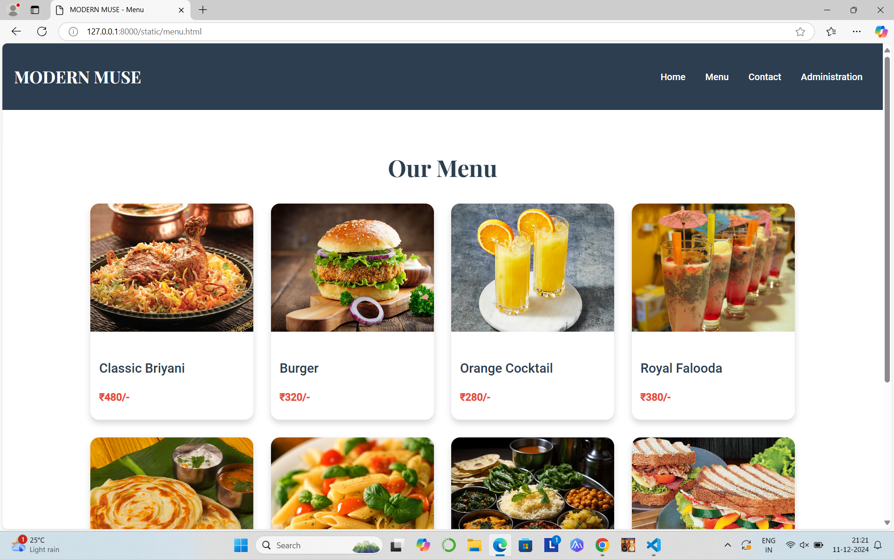
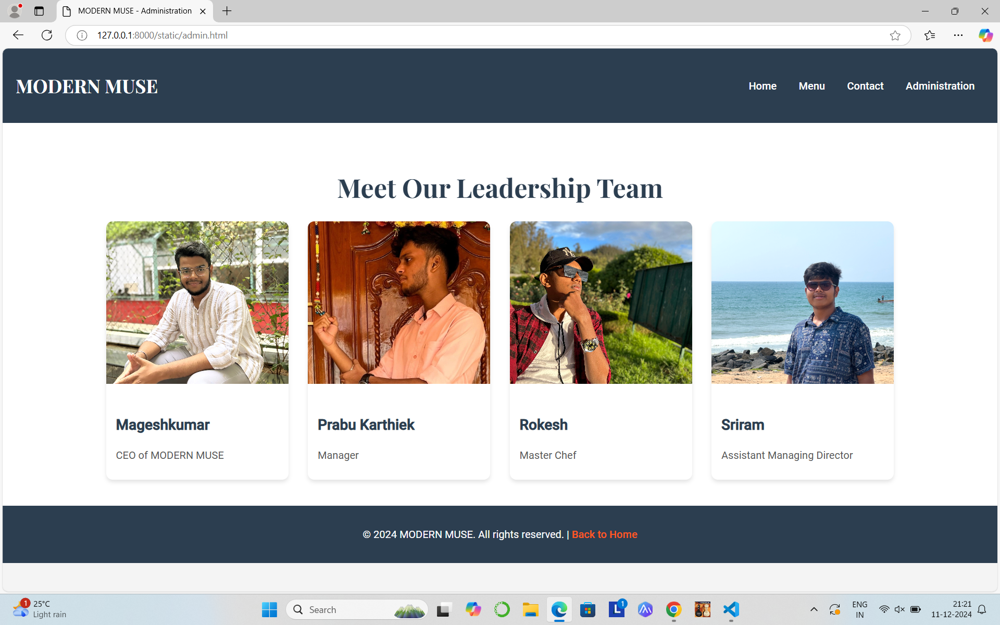
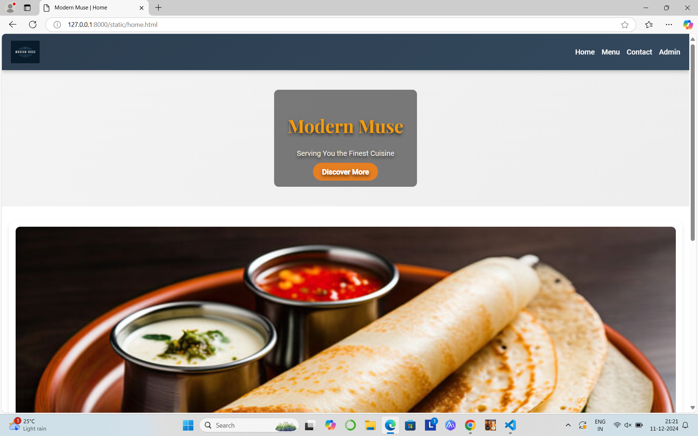

# Ex.07 Restaurant Website
## Date:11-12-2024

## AIM:
To develop a static Restaurant website to display the food items and services provided by them.

## DESIGN STEPS:

### Step 1:
Requirement collection.

### Step 2:
Creating the layout using HTML and CSS.

### Step 3:
Updating the sample content.

### Step 4:
Choose the appropriate style and color scheme.

### Step 5:
Validate the layout in various browsers.

### Step 6:
Validate the HTML code.

### Step 7:
Publish the website in the given URL.

## PROGRAM:
```
home.html

<!DOCTYPE html>
<html lang="en">
<head>
    <meta charset="UTF-8">
    <meta name="viewport" content="width=device-width, initial-scale=1.0">
    <title>Modern Muse | Home</title>
    <link href="https://fonts.googleapis.com/css2?family=Roboto:wght@400;500&family=Playfair+Display:wght@700&display=swap" rel="stylesheet">
    <style>
        body {
            margin: 0;
            font-family: 'Roboto', sans-serif;
            line-height: 1.6;
            color: #333;
            background: linear-gradient(135deg, #f4f4f4, #eaeaea);
            box-sizing: border-box;
        }

        *, *::before, *::after {
            box-sizing: inherit;
        }

        header {
            background: linear-gradient(135deg, #2c3e50, #34495e);
            color: white;
            padding: 15px 20px;
            display: flex;
            align-items: center;
            justify-content: space-between;
            box-shadow: 0 4px 8px rgba(0, 0, 0, 0.2);
            position: sticky;
            top: 0;
            z-index: 1000;
        }

        header img {
            height: 50px;
        }

        header nav {
            display: flex;
            gap: 15px;
        }

        header nav a {
            text-decoration: none;
            color: white;
            font-weight: 500;
            font-size: 1rem;
            transition: color 0.3s ease;
        }

        header nav a:hover {
            color: #e67e22;
        }

        .banner {
            display: flex;
            align-items: center;
            justify-content: center;
            padding: 40px 20px;
            background: url('banner-placeholder.jpg') no-repeat center center/cover;
            color: white;
            height: 300px;
            text-shadow: 0 4px 8px rgba(0, 0, 0, 0.7);
            text-align: center;
        }

        .banner-content {
            background: rgba(0, 0, 0, 0.5);
            padding: 20px 30px;
            border-radius: 10px;
        }

        .banner-content h1 {
            font-family: 'Playfair Display', serif;
            font-size: 2.5rem;
            margin-bottom: 10px;
            color: #f39c12;
        }

        .banner-content p {
            font-size: 1rem;
            margin-bottom: 15px;
            color: #ecf0f1;
        }

        .banner-content a {
            background: #e67e22;
            color: white;
            padding: 10px 20px;
            text-decoration: none;
            font-weight: bold;
            border-radius: 50px;
            transition: background 0.3s ease, transform 0.3s ease;
        }

        .banner-content a:hover {
            background: #d35400;
            transform: translateY(-3px);
        }

        .features {
            display: grid;
            grid-template-columns: repeat(auto-fit, minmax(250px, 1fr));
            gap: 20px;
            padding: 30px 15px;
            background: #ffffff;
        }

        .feature {
            background: white;
            border-radius: 15px;
            padding: 15px;
            box-shadow: 0 4px 8px rgba(0, 0, 0, 0.1);
            text-align: center;
            transition: transform 0.3s ease;
        }

        .feature:hover {
            transform: translateY(-5px);
        }

        .feature img {
            width: 100%;
            border-radius: 10px;
            margin-bottom: 10px;
            transition: transform 0.3s ease;
        }

        .feature img:hover {
            transform: scale(1.05);
        }

        .feature h3 {
            font-size: 1.2rem;
            margin-bottom: 8px;
            color: #2c3e50;
            font-family: 'Playfair Display', serif;
        }

        .feature p {
            font-size: 0.9rem;
            color: #7f8c8d;
        }

        footer {
            background: linear-gradient(135deg, #2c3e50, #34495e);
            color: white;
            text-align: center;
            padding: 15px;
            margin-top: 30px;
        }

        footer a {
            color: #e67e22;
            text-decoration: none;
            font-weight: 500;
            transition: color 0.3s ease;
        }

        footer a:hover {
            color: #ecf0f1;
        }

        @media (max-width: 768px) {
            header nav {
                flex-direction: column;
                align-items: center;
                gap: 10px;
            }

            .banner {
                height: auto;
                padding: 20px;
            }

            .banner-content h1 {
                font-size: 2rem;
            }

            .banner-content p {
                font-size: 0.9rem;
            }
        }

        @media (max-width: 480px) {
            .banner-content h1 {
                font-size: 1.8rem;
            }

            .banner-content p {
                font-size: 0.8rem;
            }

            .banner-content a {
                padding: 8px 15px;
                font-size: 0.9rem;
            }
        }
    </style>
</head>
<body>
    <header>
        
        <nav>
            <a href="home.html">Home</a>
            <a href="menu.html">Menu</a>
            <a href="contact.html">Contact</a>
            <a href="admin.html">Admin</a>
        </nav>
    </header>

    <div class="banner">
        <div class="banner-content">
            <h1>Modern Muse</h1>
            <p>Serving You the Finest Cuisine</p>
            <a href="#features">Discover More</a>
        </div>
    </div>

    <section id="features" class="features">
        <div class="feature">
            
            <h3>High Quality Dishes</h3>
            <p>Indulge in the finest and freshest meals crafted with love and expertise.</p>
        </div>
    </section>
    <footer>
        <p>&copy; 2024 Modern Muse. All rights reserved. | <a href="#">Privacy Policy</a></p>
    </footer>
</body>
</html>

menu.html

<!DOCTYPE html>
<html lang="en">
<head>
    <meta charset="UTF-8">
    <meta name="viewport" content="width=device-width, initial-scale=1.0">
    <title>MODERN MUSE - Menu</title>
    <link href="https://fonts.googleapis.com/css2?family=Roboto:wght@400;500&family=Playfair+Display:wght@700&display=swap" rel="stylesheet">
    <style>
        body {
            margin: 0;
            font-family: 'Roboto', sans-serif;
            line-height: 1.6;
            color: #333;
            background-color: #f4f4f4;
            box-sizing: border-box;
        }

        *, *::before, *::after {
            box-sizing: inherit;
        }

        header {
            background: #2c3e50;
            color: white;
            padding: 15px 20px;
            display: flex;
            align-items: center;
            justify-content: space-between;
            box-shadow: 0 4px 6px rgba(0, 0, 0, 0.1);
        }

        header h1 {
            font-size: 1.8rem;
            font-family: 'Playfair Display', serif;
        }

        header nav a {
            text-decoration: none;
            color: white;
            font-weight: 500;
            margin: 0 15px;
            transition: color 0.3s ease;
            font-size: 1rem;
        }

        header nav a:hover {
            color: #ff5722;
        }

        .menu-container {
            padding: 40px 20px;
            background: #ffffff;
            text-align: center;
        }

        .menu-container h1 {
            font-size: 2.5rem;
            color: #2c3e50;
            margin-bottom: 30px;
            font-family: 'Playfair Display', serif;
        }

        .menu-items {
            display: flex;
            flex-wrap: wrap;
            gap: 30px;
            justify-content: center;
        }

        .menu-item {
            background: white;
            border-radius: 15px;
            box-shadow: 0 6px 10px rgba(0, 0, 0, 0.15);
            width: 280px;
            overflow: hidden;
            transition: transform 0.3s ease, box-shadow 0.3s ease;
            text-align: left;
        }

        .menu-item img {
            width: 100%;
            height: 220px;
            object-fit: cover;
            transition: transform 0.3s ease;
        }

        .menu-item:hover {
            transform: scale(1.05);
            box-shadow: 0 6px 12px rgba(0, 0, 0, 0.2);
        }

        .menu-item:hover img {
            transform: scale(1.1);
        }

        .menu-details {
            padding: 15px;
        }

        .menu-details h3 {
            font-size: 1.4rem;
            color: #2c3e50;
            margin-bottom: 10px;
            font-weight: 500;
        }

        .menu-details p {
            font-size: 1rem;
            color: #555;
            margin-bottom: 10px;
        }

        .menu-details .price {
            font-weight: bold;
            font-size: 1.1rem;
            color: #e74c3c;
        }

        footer {
            background: #2c3e50;
            color: white;
            text-align: center;
            padding: 15px 0;
        }

        footer a {
            color: #ff5722;
            text-decoration: none;
            font-weight: 500;
            transition: color 0.3s ease;
        }

        footer a:hover {
            color: #ecf0f1;
        }

        @media (max-width: 768px) {
            header h1 {
                font-size: 1.5rem;
            }

            .menu-items {
                flex-direction: column;
                gap: 20px;
            }

            .menu-item {
                width: 100%;
            }

            header nav a {
                font-size: 0.9rem;
                margin: 0 5px;
            }
        }
    </style>
</head>
<body>

    <header>
        <h1>MODERN MUSE</h1>
        <nav>
            <a href="home.html">Home</a>
            <a href="menu.html">Menu</a>
            <a href="contact.html">Contact</a>
            <a href="admin.html">Administration</a>
        </nav>
    </header>

    <div class="menu-container">
        <h1>Our Menu</h1>
        <div class="menu-items">
            <div class="menu-item">
                
                <div class="menu-details">
                    <h3>Classic Briyani</h3>
                    <p class="price">₹480/-</p>
                </div>
            </div>

            <div class="menu-item">
                
                <div class="menu-details">
                    <h3>Burger</h3>
                    <p class="price">₹320/-</p>
                </div>
            </div>

            <div class="menu-item">
                
                <div class="menu-details">
                    <h3>Orange Cocktail</h3>
                    <p class="price">₹280/-</p>
                </div>
            </div>

            <div class="menu-item">
                
                <div class="menu-details">
                    <h3>Royal Falooda</h3>
                    <p class="price">₹380/-</p>
                </div>
            </div>

            <div class="menu-item">
                
                <div class="menu-details">
                    <h3>Parotta</h3>
                    <p class="price">₹250/-</p>
                </div>
            </div>

            <div class="menu-item">
                
                <div class="menu-details">
                    <h3>Pasta</h3>
                    <p class="price">₹300/-</p>
                </div>
            </div>

            <div class="menu-item">
                
                <div class="menu-details">
                    <h3>Veg Meals</h3>
                    <p class="price">₹350/-</p>
                </div>
            </div>

            <div class="menu-item">
                
                <div class="menu-details">
                    <h3>Sandwich</h3>
                    <p class="price">₹250/-</p>
                </div>
            </div>
        </div>
    </div>

    <footer>
        <p>&copy; 2024 MODERN MUSE. All rights reserved. | <a href="home.html">Back to Home</a></p>
    </footer>

</body>
</html>

contact.html

<!DOCTYPE html>
<html lang="en">
<head>
    <meta charset="UTF-8">
    <meta name="viewport" content="width=device-width, initial-scale=1.0">
    <title>MODERN MUSE - Contact Us</title>
    <link href="https://fonts.googleapis.com/css2?family=Roboto:wght@400;500&family=Playfair+Display:wght@700&display=swap" rel="stylesheet">
    <style>
        body {
            margin: 0;
            font-family: 'Roboto', sans-serif;
            line-height: 1.6;
            color: #333;
            background-color: #f4f4f4;
            box-sizing: border-box;
        }

        *, *::before, *::after {
            box-sizing: inherit;
        }

        header {
            background: #2c3e50;
            color: white;
            padding: 15px 20px;
            display: flex;
            align-items: center;
            justify-content: space-between;
            box-shadow: 0 4px 6px rgba(0, 0, 0, 0.1);
        }

        header img {
            height: 50px;
        }

        header nav a {
            text-decoration: none;
            color: white;
            font-weight: 500;
            margin: 0 15px;
            transition: color 0.3s ease;
            font-size: 1rem;
        }

        header nav a:hover {
            color: #ff5722;
        }

        .contact-banner {
            display: flex;
            align-items: center;
            justify-content: center;
            background: url('contact.jpeg') no-repeat center center/cover;
            color: white;
            height: 400px;
            text-shadow: 0 2px 4px rgba(0, 0, 0, 0.8);
            text-align: center;
        }

        .contact-banner h1 {
            font-family: 'Playfair Display', serif;
            font-size: 3rem;
            color: #f39c12;
        }

        .contact-section {
            display: flex;
            justify-content: center;
            padding: 40px 20px;
            background: #ffffff;
            gap: 40px;
        }

        .contact-details, .contact-form {
            background: white;
            padding: 20px;
            border-radius: 10px;
            box-shadow: 0 4px 6px rgba(0, 0, 0, 0.1);
            max-width: 500px;
            flex: 1;
        }

        .contact-details h2, .contact-form h2 {
            font-size: 1.8rem;
            margin-bottom: 15px;
            color: #2c3e50;
            font-family: 'Playfair Display', serif;
            text-align: center;
        }

        .contact-details p {
            margin: 10px 0;
            font-size: 1rem;
            color: #555;
        }

        .contact-details img {
            max-width: 100%;
            border-radius: 10px;
            margin-bottom: 20px;
        }

        .contact-form input, .contact-form textarea {
            width: 100%;
            padding: 10px;
            margin: 10px 0;
            border: 1px solid #ccc;
            border-radius: 5px;
            font-size: 1rem;
        }

        .contact-form textarea {
            height: 120px;
        }

        .contact-form button {
            width: 100%;
            padding: 12px;
            background: #ff5722;
            color: white;
            font-size: 1.1rem;
            border: none;
            border-radius: 5px;
            cursor: pointer;
            transition: background 0.3s ease;
        }

        .contact-form button:hover {
            background: #e64a19;
        }

        footer {
            background: #2c3e50;
            color: white;
            text-align: center;
            padding: 20px 0;
        }

        footer a {
            color: #ff5722;
            text-decoration: none;
            font-weight: 500;
            transition: color 0.3s ease;
        }

        footer a:hover {
            color: #ecf0f1;
        }

        @media (max-width: 768px) {
            .contact-details, .contact-form {
                max-width: 100%;
            }

            .contact-banner h1 {
                font-size: 2.5rem;
            }

            header nav a {
                font-size: 0.9rem;
                margin: 5px;
            }

            .contact-section {
                flex-direction: column;
                align-items: center;
                gap: 20px;
            }
        }
    </style>
</head>
<body>

    <header>
        
        <nav>
            <a href="home.html">Home</a>
            <a href="menu.html">Menu</a>
            <a href="contact.html">Contact</a>
            <a href="admin.html">Administration</a>
        </nav>
    </header>

    <div class="contact-banner">
        <h1>Contact Us</h1>
    </div>

    <section class="contact-section">
        <div class="contact-details">
            <h2>Contact Us</h2>
            <p><strong>Address:</strong> MODERN MUSE, Chennai, Tamilnadu, India</p>
            <p><strong>Phone:</strong> +91 9342155161</p>
            <p><strong>Email:</strong> modernmuse@gmail.com</p>
            <p><strong>Hours:</strong> Mon-Sun: 9 AM - 10 PM</p>
        </div>
    </section>

    <footer>
        <p>&copy; 2024 MODERN MUSE. All rights reserved. | <a href="#">Privacy Policy</a></p>
    </footer>

</body>
</html>

admin.html

<!DOCTYPE html>
<html lang="en">
<head>
    <meta charset="UTF-8">
    <meta name="viewport" content="width=device-width, initial-scale=1.0">
    <title>MODERN MUSE - Administration</title>
    <link href="https://fonts.googleapis.com/css2?family=Roboto:wght@400;500&family=Playfair+Display:wght@700&display=swap" rel="stylesheet">
    <style>
        body {
            margin: 0;
            font-family: 'Roboto', sans-serif;
            line-height: 1.6;
            color: #333;
            background-color: #f4f4f4;
            box-sizing: border-box;
        }

        *, *::before, *::after {
            box-sizing: inherit;
        }

        header {
            background: #2c3e50;
            color: white;
            padding: 15px 20px;
            display: flex;
            align-items: center;
            justify-content: space-between;
            box-shadow: 0 4px 6px rgba(0, 0, 0, 0.1);
        }

        header h1 {
            font-size: 1.8rem;
            font-family: 'Playfair Display', serif;
        }

        header nav a {
            text-decoration: none;
            color: white;
            font-weight: 500;
            margin: 0 15px;
            transition: color 0.3s ease;
            font-size: 1rem;
        }

        header nav a:hover {
            color: #ff5722;
        }

        .admin-container {
            padding: 40px 20px;
            background: #ffffff;
            text-align: center;
        }

        .admin-container h1 {
            font-size: 2.5rem;
            color: #2c3e50;
            margin-bottom: 20px;
            font-family: 'Playfair Display', serif;
        }

        .admin-items {
            display: flex;
            flex-wrap: wrap;
            gap: 30px;
            justify-content: center;
        }

        .admin-item {
            background: white;
            border-radius: 10px;
            box-shadow: 0 4px 6px rgba(0, 0, 0, 0.1);
            width: 280px;
            overflow: hidden;
            transition: transform 0.3s ease;
            text-align: left;
        }

        .admin-item img {
            width: 100%;
            height: 250px;
            object-fit: cover;
        }

        .admin-item:hover {
            transform: scale(1.05);
        }

        .admin-details {
            padding: 15px;
        }

        .admin-details h3 {
            font-size: 1.4rem;
            color: #2c3e50;
            margin-bottom: 8px;
        }

        .admin-details p {
            font-size: 1rem;
            color: #555;
            margin-bottom: 10px;
        }

        footer {
            background: #2c3e50;
            color: white;
            text-align: center;
            padding: 15px 0;
        }

        footer a {
            color: #ff5722;
            text-decoration: none;
            font-weight: 500;
            transition: color 0.3s ease;
        }

        footer a:hover {
            color: #ecf0f1;
        }

        @media (max-width: 768px) {
            header h1 {
                font-size: 1.5rem;
            }

            .admin-items {
                flex-direction: column;
                gap: 20px;
            }

            .admin-item {
                width: 100%;
            }

            header nav a {
                font-size: 0.9rem;
                margin: 0 5px;
            }
        }
    </style>
</head>
<body>

    <header>
        <h1>MODERN MUSE</h1>
        <nav>
            <a href="home.html">Home</a>
            <a href="menu.html">Menu</a>
            <a href="contact.html">Contact</a>
            <a href="admin.html">Administration</a>
        </nav>
    </header>

    <div class="admin-container">
        <h1>Meet Our Leadership Team</h1>
        <div class="admin-items">
            <div class="admin-item">
                
                <div class="admin-details">
                    <h3>Mageshkumar</h3>
                    <p>CEO of MODERN MUSE</p>
                </div>
            </div>

            <div class="admin-item">
                
                <div class="admin-details">
                    <h3>Prabu Karthiek</h3>
                    <p>Manager</p>
                </div>
            </div>

            <div class="admin-item">
                
                <div class="admin-details">
                    <h3>Rokesh</h3>
                    <p>Master Chef</p>
                </div>
            </div>

            <div class="admin-item">
                
                <div class="admin-details">
                    <h3>Sriram</h3>
                    <p>Assistant Managing Director</p>
                </div>
            </div>
        </div>
    </div>

    <footer>
        <p>&copy; 2024 MODERN MUSE. All rights reserved. | <a href="home.html">Back to Home</a></p>
    </footer>

</body>
</html>

```


## OUTPUT:

 

 



## RESULT:
The program for designing software company website using HTML and CSS is completed successfully.
